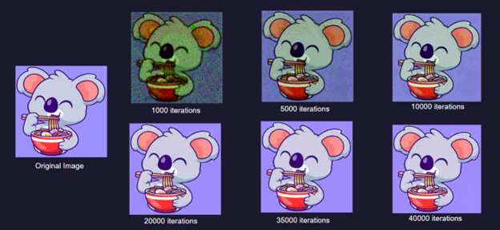
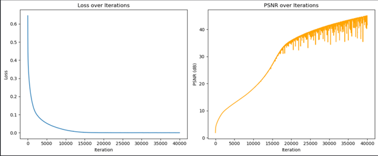

# Deep Image Prior for Blind JPEG Image Restoration

## Paper

Link: https://arxiv.org/abs/1711.10925

- The paper presents a unique method for image restoration that leverages the structure of a convolutional neural network as an image prior, without the need for any pre-training
- The authors argue that the structure of a generator network captures valuable low-level image statistics and is enough to perform well in tasks such as denoising and super-resolution
- Instead of training the ConvNet on a large dataset of images, this method fits the network to a single degraded image and the network weights act as a parameterization of the restored image
- This approach is based on the idea that ConvNets exhibit high impedance to noise and low impedance to signal and can recover details and remove compression artifacts from JPEG images
- However, with more iterations, the model may eventually overfit to the compressed input

## Model Architecture 

- Primary Architecture: Encoder-Decoder network (Hourglass/U-Net)
- Network takes an image and passes to two parts:
  - Encoder (5 layers): gradually shrinks the image while learning and extracting important information
  - Decoder (5 layers): gradually expands (reconstructs) the shrunk image back to original size using the learned features
- Skip connections helped preserve fine details from original image during encoding-decoding process

## Challenges

- The primary challenge we faced was finding the right balance:
  - Experimented with different number of layers
  - Varied the number of channels in each layer
  - Tried using Skip connections to improve the information flow
  - Observed the effect of image quality and PSNR with different number of iterations and learning rate

## Results

Images Generated by the Model over Iterations:

Training Loss and PSNR trend:

